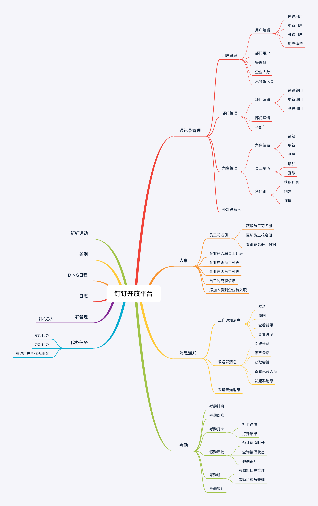

# 对接钉钉开放管理后台
#### 版本技术
-   v1.0版本
-   java开发
-   钉钉开发者

#### 功能图

#### 开发功能模块

+ 通讯录管理
  + 用户管理
    + 用户编辑
    + 部门用户
    + 管理员
    + 企业人数
    + 未登录人员
  + 部门管理
    + 部门编辑
    + 子部门
  + 角色管理
    + 角色编辑
    + 员工角色
    + 角色组
+ 人事管理
  + 在职员工
  + 员工入职
  + 员工离职
  + 自定义审核
    + 自定义实例
+ 考勤管理
  + 考勤组
    + 考勤组成员
    + 考勤组信息
  + 考勤排班
  + 考勤班次
  + 考勤打卡
    + 打卡详情
    + 打卡结果
  + 假勤审批
    + 加班
    + 出差
    + 请假
  + 考勤统计

#### 主要开发方向

1、钉钉的对接开放后台。

2、整合到灵动管理后台。

#### 预计时间

| 时间点 | 工作内容 |
| :----- | :------- |
|        |          |
|        |          |

